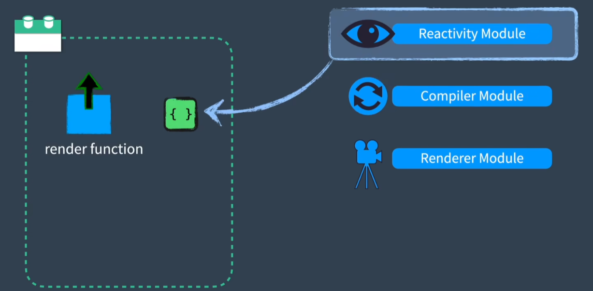
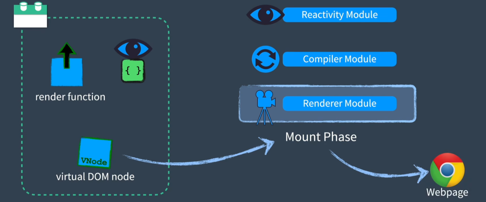

# vue

实现超级简易版的 vue

## 运行流程

在一个具备**模板**和**内部使用的响应对象**的组件中（如下图所示）

首先，模板编译器（template compiler）会将 HTML 转换为一个渲染函数（render function），然后使用响应式模块（reactivity module）对**内部使用的响应对象**进行初始化。

接着，进入渲染阶段（render phase），使用渲染模块（renderer module）调用引用了**内部使用的响应对象**的渲染函数（render function），这会使得渲染函数（render function）返回一个虚拟节点（Virtual DOM），于此同时还将监听**内部使用的响应对象**的变化。随后进入挂载阶段（mount phase），调用挂载函数（mount function）使用虚拟节点（Virtual DOM）创建 web 页面。

最后，由于之前监听了**内部使用的响应对象**的变化，如果**内部使用的响应对象**一旦发生了变化，渲染器将再次调用渲染函数（render function）创建一个新的虚拟节点（Virtual DOM），并将新旧虚拟节点（Virtual DOM）发送到补丁函数（patch phase）中进行比较，然后将差异应用到 web 页面中。

