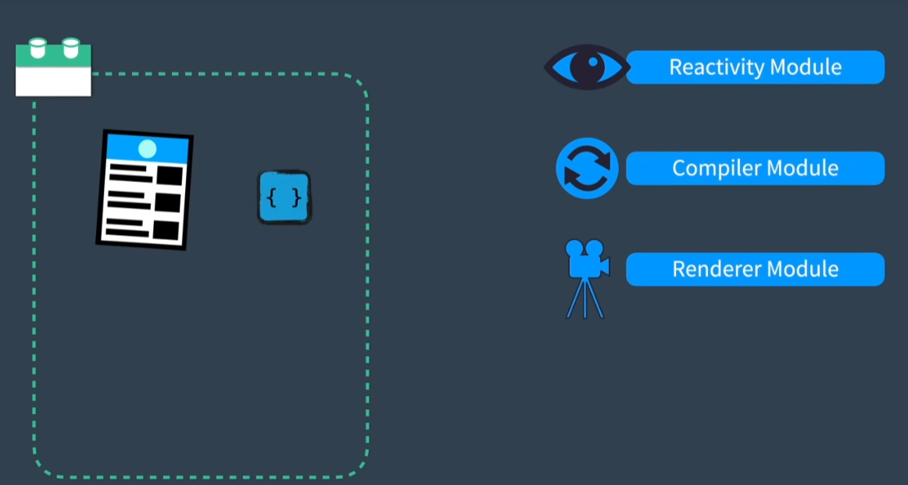
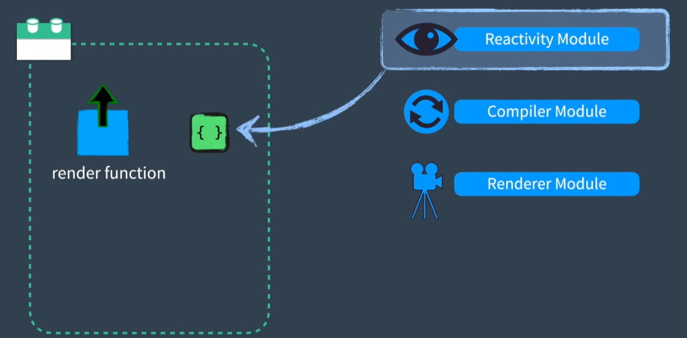
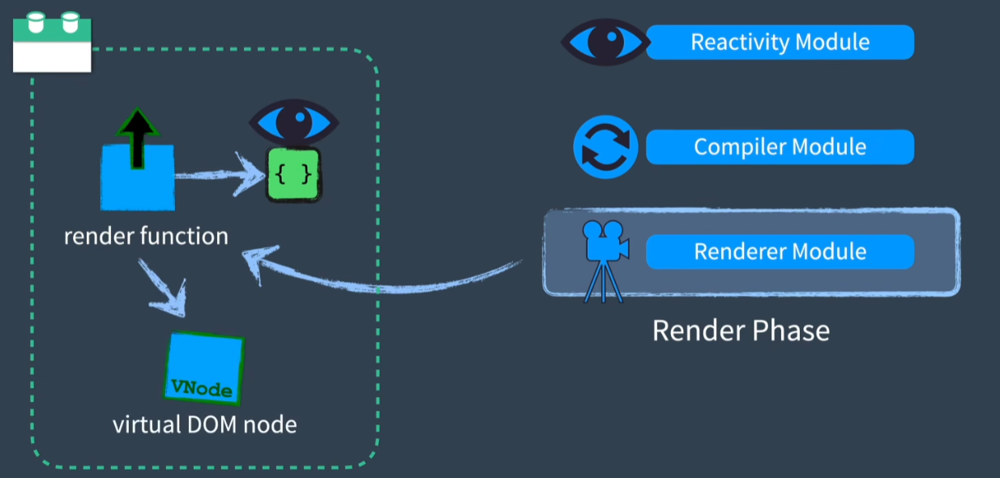
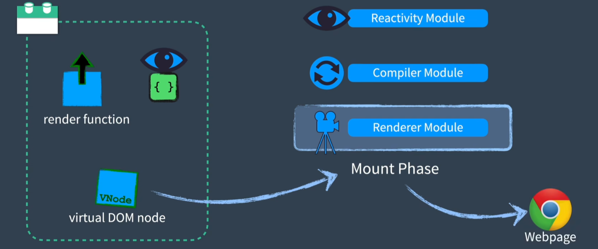
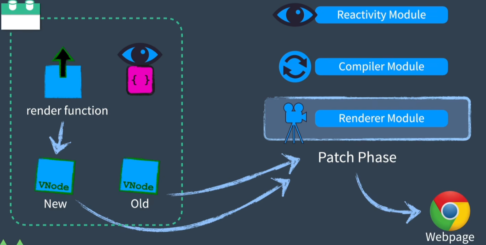

# vue

实现超级简易版的 vue

```bash
pnpm dev vue base -p vue

pnpm dev vue base -p vue -f esm

pnpm dev vue base -p vue -f cjs
```

## 运行流程

在一个具备**模板**和**内部使用的响应对象**的组件中（如下图所示）


首先，模板编译器（template compiler）会将 HTML 转换为一个渲染函数（render function），然后使用响应式模块（reactivity module）对**内部使用的响应对象**进行初始化。


接着，进入渲染阶段（render phase），使用渲染模块（renderer module）调用引用了**内部使用的响应对象**的渲染函数（render function），这会使得渲染函数（render function）返回一个虚拟节点（Virtual DOM），于此同时还将监听**内部使用的响应对象**的变化。随后进入挂载阶段（mount phase），调用挂载函数（mount function）使用虚拟节点（Virtual DOM）创建 web 页面。



最后，由于之前监听了**内部使用的响应对象**的变化，如果**内部使用的响应对象**一旦发生了变化，渲染器将再次调用渲染函数（render function）创建一个新的虚拟节点（Virtual DOM），并将新旧虚拟节点（Virtual DOM）发送到补丁函数（patch phase）中进行比较，然后将差异应用到 web 页面中。


## render function

### h difference

in vue2

```js
render(h){
    return h('div',{
        attrs:{
            id:'app'
        },
        on:{
            click:this.onClick
        }
    }, 'hello') // hello 是子组件的模板（也可以是嵌套的数组）
}
```

h 的第一个参数是标签名。
第二个参数是属性对象，包含所有虚拟节点（vnode）上的所有数据、属性，这使得这个 API 过于冗长，必须指明传递给节点的绑定类型。
第三个参数是子组件的模板（也可以是嵌套的数组，并且嵌套了更多的嵌套的 h 调用）

in vue3

```js
import { h } from 'vue'
render (){
    return h('div',{
        id:'app',
        onClick:this.onClick
    }, 'hello')
}
```

h 的第一个参数是标签名。
第二个参数是属性对象，但永远是一个扁平的对象了。
第三个参数是子组件的模板（也可以是嵌套的数组，并且嵌套了更多的嵌套的 h 调用）
另外一点不同是：h 在 Vue3 是直接从 vue 中导入的

### example

#### normal using

```js
import { h } from "vue";

const App = {
  render() {
    return h(
      "div",
      {
        id: "hello",
      },
      [h("span", "world")]
    );
  },
};

// <div id="hello"><span>world></span></div>
```

#### using v-if in h

```js
import { h } from "vue";

const App = {
  render() {
    // v-if="ok"
    return this.ok ?
        ? h("div", {id:'hello'}, [h("span", "world")])
        : this.otherCondition
            ? h("p","other branch")
            : h('span')
  },
};

// or

const App = {
  render() {
    // v-if="ok"
    let nodeToReturn
    if(this.ok){
        nodeToReturn = ...
    }else if(){
        nodeToReturn = ...
    }
  }
}
```

#### using v-for in h

```js
import { h } from "vue";

const App = {
  render() {
    // v-for="item in list"
    return this.list.map((item) => {
      return h("div", { key: item.id }, item.text);
    });
  },
};
```

#### using slots in h

```js
import { h } from "vue";

const App = {
  render() {
    const slot = this.$slots.default
      ? // 作用域插槽
        // this.$slots.default({})
        this.$slots.default()
      : [];
  },
};
```

## cache pref

```vue
<template>
  <Foo id="foo" @click="foo(123)">hello</Foo>
</template>
```

在 vue2 中，给一个组件传递的数据，即使什么都不改变，对于这个组件，它仍然会导致子组件在父组件重新渲染时重新渲染，在大型项目中，这种情况会引起连锁效应。
因为在向下传递函数，在每次渲染时都会创建一个新的内联函数会导致所有这些收到这个 prop 的子组件重新渲染。

在 Vue3 中，使用了句柄缓存极大减少了在大型组件树种发生不必要的渲染。
